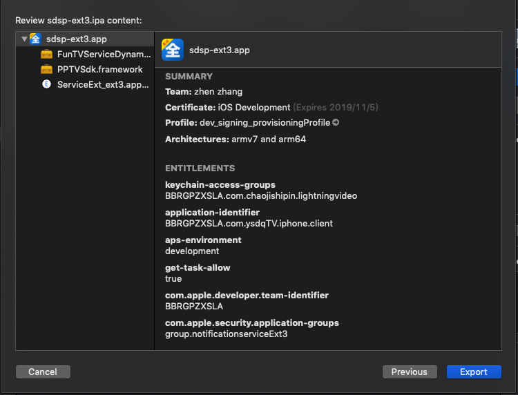
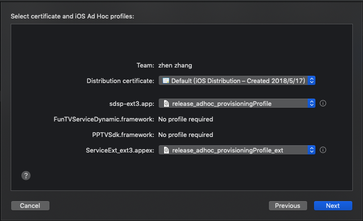
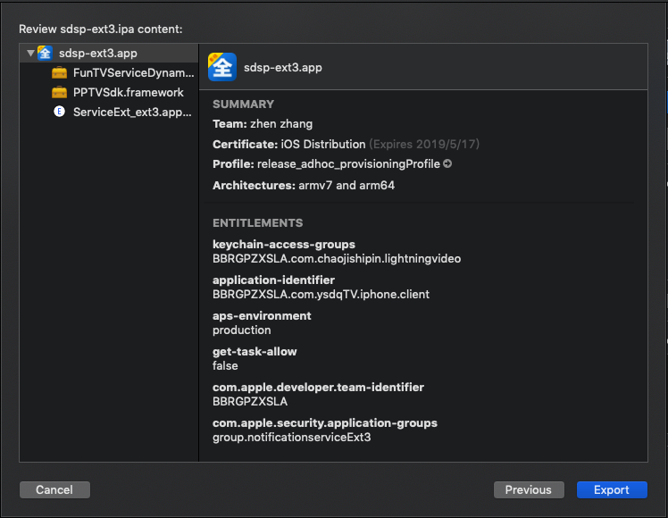
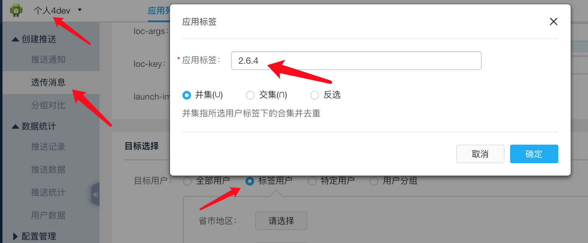
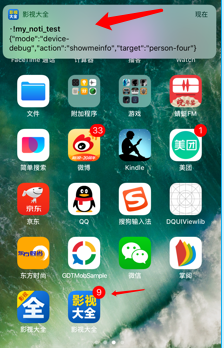
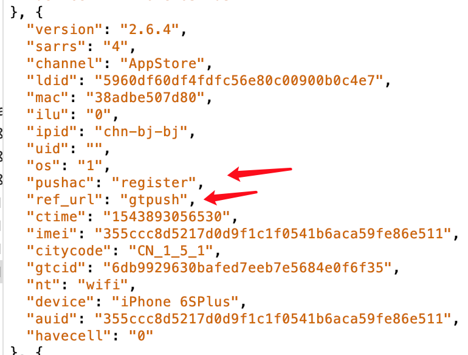
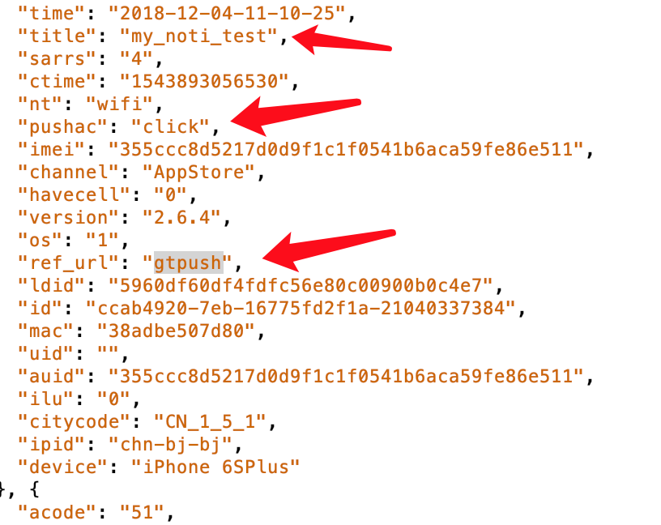
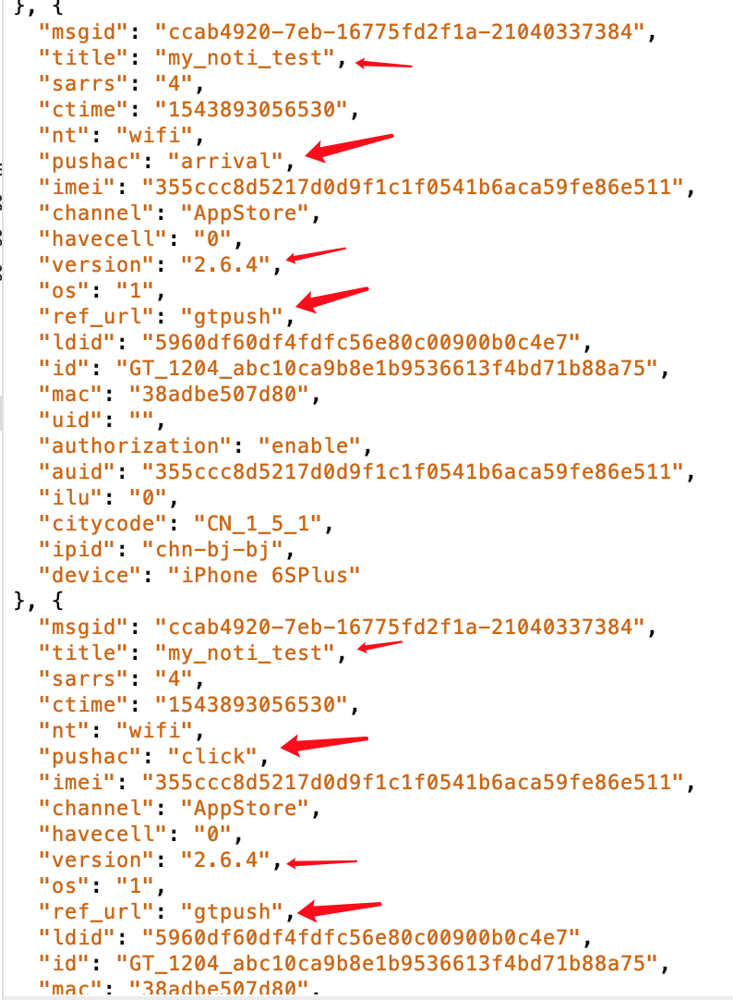

# GeTui - ServiceExtension 先运行项目，再运行应用扩展

## iOS推送
1. [基本推送功能](https://www.jianshu.com/p/bb89d636f989)
2. [调试tip](https://github.com/liuyanhongwl/ios_common/blob/master/files/App-Extension-Tips.md)

## 实现扩展和宿主App之间共享数据
1. [APP Group](https://blog.csdn.net/LOLITA0164/article/details/79006679) 
2. [官方文档](https://www.jianshu.com/p/aa6f4f41d6e3)
3. [Debug, Profile, and Test Your App Extension](https://developer.apple.com/library/archive/documentation/General/Conceptual/ExtensibilityPG/ExtensionCreation.html#//apple_ref/doc/uid/TP40014214-CH5-SW1)

## Getui plat
[个推推送后台：](https://dev.getui.com/#/login)
账号：tv365
旧密码：!Ysdq@2018#
新密码：tv365Yingshi!2018
[GeTui - API](http://docs.getui.com/getui/mobile/ios/api/)


## [需求文档](http://wiki.shandianshipin.cn:8090/pages/viewpage.action?pageId=12290046)
1. 需明确有多少用户关闭了推送通知权限 - 客户端启动时上报
需明确区分走个推/厂商通道的推送
已有推送上报：Push推送id、到达、点击事件上报

 
## reference： 
 https://www.jianshu.com/p/559fb72a99d0


## debug questions
[路径配置参考01](https://www.cnblogs.com/shirley-1019/p/3823906.html)
1. 使用extentsion target测试， 程序在后台执行，推送到达时候应用报错，无法debug查看
> Message from debugger: Terminated due to signal 9


error::-1: Multiple commands produce '/Users/lxw/Library/Developer/Xcode/DerivedData/Le123PhoneClient-bqwcehbbulnyxecmihznrqlecpit/Build/Products/Debug-iphoneos/ServiceExt_ext3.appex/Info.plist':
1) Target 'ServiceExt_ext3' (project 'Le123PhoneClient') has copy command from '/Users/lxw/Desktop/ntc/repositories/ysdq/Le123PhoneClient/Targets/ServiceExt_ext3/Info.plist' to '/Users/lxw/Library/Developer/Xcode/DerivedData/Le123PhoneClient-bqwcehbbulnyxecmihznrqlecpit/Build/Products/Debug-iphoneos/ServiceExt_ext3.appex/Info.plist'

2) Target 'ServiceExt_ext3' (project 'Le123PhoneClient') has process command with output '/Users/lxw/Library/Developer/Xcode/DerivedData/Le123PhoneClient-bqwcehbbulnyxecmihznrqlecpit/Build/Products/Debug-iphoneos/ServiceExt_ext3.appex/Info.plist'

> [Solution -> Open target -> Build phases > Copy Bundle Resources and remove info.plist](https://stackoverflow.com/questions/50718018/xcode-10-error-multiple-commands-produce)


## 多Targets path configure
1. Target3
Packaging >> Info.plist File:  $(SRCROOT)/Le123PhoneClient/Targets/sdsp-ext3/sdsp-ext3.plist

2. 编译宏添加： Build Settings >> Preprocessor Macros 定义TargetValue宏
3. 


## TODO: 
1. 添加ExtensionService，
2. 添加上报代码
    a.获取上报参数，
    b.文件引入处理。
    
## 打包测试：
> 打包上传AppStore 或者进行testFlight测试的时候，需要build号 版本号的一致，否则会受到传包警告如下：


1. [参考文档](http://www.cocoachina.com/ios/20170605/19438.html)
2. Build Settings >> Build Active Architecture Only : NO  ？ 


### Xcode自动管理签名打包。
release_appStore包，经过TestFlight 测试，可行。

### 手动创建证书配置文件打包
<!--What type of provisioning profile do you need?-->
#### devProfile 真机联调【iPhone Developer：zhen zhang(LY4BJURFPH)】: 
1. Select App ID【com.ysdqTV.iphone.client】
    <!--If you plan to use services such as Game Center, In-App Purchase, and Push Notifications, or want a Bundle ID unique to a single app, use an explicit App ID. If you want to create one provisioning profile for multiple apps or don't need a specific Bundle ID, select a wildcard App ID. Wildcard App IDs use an asterisk (*) as the last digit in the Bundle ID field. Please note that iOS App IDs and Mac App IDs cannot be used interchangeably.-->
2. Select certificates【Select All】
	<!--Select the certificates you wish to include in this provisioning profile. To use this profile to install an app, the certificate the app was signed with must be included.-->

3. Select devices.【Select All】
   <!-- Select the devices you wish to include in this provisioning profile. To install an app signed with this profile on a device, the device must be included.-->

4. Name this profile and generate.【dev_signing_provisioningProfile】
    <!--The name you provide will be used to identify the profile in the portal.-->

5. download:
```
Profile Name:   dev_signing_provisioningProfile
Type:           iOS Development
App ID:         ysdq2018 (BBRGPZXSLA.com.ysdqTV.iphone.client)
Certificates:   9Included
Devices:        50Included
```

测试：
Target-ext3:
	Signing(Debug):		dev_signing_provisioningProfile.	
ServiceExt_ext3:
	Signing(Debug):		dev_signing_provisioningProfile_ext
如果选择与宿主target同一个配置文件会有如下提示：
    <!--Provisioning profile "dev_signing_provisioningProfile" has app ID "com.ysdqTV.iphone.client", which does not match the bundle ID "com.ysdqTV.iphone.client.ServiceExt-ext3".-->

同步骤生成ext的dev配置文件：

```
Profile Name:   dev_signing_provisioningProfile_ext
Type:           iOS Development
App ID:         XC com ysdqTV iphone client ServiceExt-ext3 (BBRGPZXSLA.com.ysdqTV.iphone.client.ServiceExt-ext3)
Certificates:   9Included
Devices:        50Included
```
>> 分别使用各自AppId对应的配置文件，测试结果，可行。

#### releaseProfile 真机联调【iPhone Developer：zhen zhang(LY4BJURFPH)】: 
1. Target >> Edit Scheme >> Run >> Info >> Build Configuration >> release

2. 配置证书组合使用：
Target-ext3:
	Signing(Release):		dev_signing_provisioningProfile.	
ServiceExt_ext3:
	Signing(Release):		dev_signing_provisioningProfile(ext)
	
>> Release环境下，使用开发者配置文件，分别使用各自AppId对应的配置文件，测试结果，可行。
	


#### devProfile debug模式打包测试【iPhone Developer：zhen zhang(LY4BJURFPH)】: 
1. Target >> Edit Scheme >> Archive >> Build Configuration >> Debug


2. Product >> Archive

3. Distribute App  >> Development | Ad Hoc  风别测试效果 （iOS App Store - testFlighting？）

a. Development
    
>>  经过fir.im 平台安装开发环境推送效果有效。【debug_development_OK】

b. Ad Hoc


需要另外创建配置证书，
#### (distribute) Profile 【iPhone Developer：zhen zhang(LY4BJURFPH)】: 
1. Select Type: Distribution
    `What type of provisioning profile do you need?`

    Ad Hoc
    `Create a distribution provisioning profile to install your app on a limited number of registered devices.`

2. Select App ID: 【com.ysdqTV.iphone.client】 


3. Select certificates.

 
选择 最新：expireTime：Sep 27，2019.

4. Select Device： all
5. The name you provide will be used to identify the profile in the portal.


```
Profile Name:       release_adhoc_provisioningProfile
Type:               iOS Distribution
App ID:             ysdq2018 (BBRGPZXSLA.com.ysdqTV.iphone.client)
Certificates:       1Included
Devices:            50Included


Profile Name:       release_adhoc_provisioningProfile_ext
Type:               iOS Distribution
App ID:             XC com ysdqTV iphone client ServiceExt-ext3 (BBRGPZXSLA.com.ysdqTV.iphone.client.ServiceExt-ext3)
Certificates:       1Included
Devices:            50Included
```


Sep 27，2019. 证书与配置文件不一致。

>> 更改为May 17， 2019 证书配置文件一致，可以打adhoc包。


>> 给debug_adhoc 包发送推送，没有收到推送通知？
   原因待查看中。 >> 寻找个推技术验证问题。
   【debug_adhoc_false】
   
   
##### release —— develoment包




>> 在release环境下推送，包收到了推送消息，但是没有经过Extension处理的消息？重新打包确认Extension处理生效。 
[release_development_ok]

##### release —— adhoc包




>> 在release环境下推送，包收到了推送消息，并且extention推送生效。【release_adhoc_ok】


> 对比打包证书：adhoc包与development包，所用的证书日期不一致。


》使用Xcode Automatically manage signing， 打包测试：
release_adhoc_autoProfile: 推送消息没有收到。
release_development_autoProfile:推送消息收到 并且效果为Extension处理过的。

TODO: 查找Xcode adhoc使用的autoProfile文件， 重命名手动引入查看打包过程及效果：


结论，使用手动配置文件打包，都可以通过。
> Xcode自动配置adhocProfile, 不能用于手动配置操作。无法验证效果


#### 真机联调效果（development_ok）
手动配置文件以及XcodeAutoProfile均OK。

#### 打包效果
##### 手动创建配置文件Profile：
【release_development_ok】
【release_adhoc_ok】
【debug_development_ok】
【debug_adhoc_false】
##### Xcode 自动配置Profile：
【release_development_false】
【release_adhoc_false】
【debug_development_false】
【debug_adhoc_false】


#### 打测试包：
##### p4:
1. debug_development_p4
2. release_adhoc_p4
3. release_appstore_p4

##### p5:
1. debug_development_p5
2. release_adhoc_p5
3. release_appstore_p5

##### pad:
1. debug_development_pad
2. release_adhoc_pad
3. release_appstore_pad


## notiServiceExt3 创建
### 账号讯息
*  iOS个人4开发者账号信息
* 	账号：ios1@tv365.net
* 	Team-Agent：zhen zhang
### 步骤
App Group ID: group.notiservice.appgroups.ext3
TARGET_VALUE=10.

#### 一、创建target notiServiceExt3
##### Xcode >> File >> New >> Target >> iOS >> Notification Service Extension
##### Choose Options for your new target


##### 工程文件配置
###### Linked Frameworks and Libraries
1. Build Phases >> Link Binary with Libraries
2. Build Phases >> Compile Sources（2 items）


###### Plist configure
添加 App Transport Security Settings >> Allow Arbitrary Loads >> YES

###### Deployment Info
Deployment Target: 10.0 ,   Devices:iPhone

###### Preprocessor Macros


###### Capbilities 
分别在Target_ext3 和 Target_notiserviceExt3 添加 App Groups
App Groups >> add 


### 完成步骤之后 直接debug 测试
#### sdsp-ext3_RUN(Debug)   能够收到通知， 
点击通知，发现appGroup无存储通知讯息，进行如下修改：


> 再次进行测试，appGroups 共享数据生效。

### Target文件路径配置 notiServiceExt3 >> Build Settings >>
1.  Info.plist File 修改如下：
$(SRCROOT)/Le123PhoneClient/Targets/notiServiceExt3/Info.plist

2. Code Signing Entitlements 修改如下：

3. targe 文件路径移动之后需要 重新勾选 App Groups。

> 补充 TODO: 删除原有AppGroupID : **group.notificationserviceExt3**.

#### 调整文件路径之后进行debug联机测试：
通知拓展     :OK
App Groups  : OK


## notiServiceExt5 创建
### 删除旧版本：
1. Targets >> choose ServiceExt_ext5  >> 点击删减符号 *—*。
2. Manage Schemes >> choose ServiceExt_ext5  >> 点击删减符号 *—*。


### 账号讯息
*  iOS个人5开发者账号信息
* 	账号：product2@tv365.net 
* 	Team-Agent：Guangyi Liu
### 步骤
> 同个人4操作。

Activate.
App Group ID: group.notiservice.appgroups.ext5
TARGET_VALUE=11.

### 测试效果：OK


### 个推拓展SDK接入
#### 目标：精确上报统计
1. 增加启动应用通知授权上报。
2. 精确个推SDK统计通知消息抵达数。
3. 精确个推统计用户自定义回执(900010-曝光，900011-点击)
4. 精确应用客户端统计统计(曝光数，和点击数)

[客户端推送上报文档wiki](http://wiki.shandianshipin.cn:8090/pages/viewpage.action?pageId=12290046)


#### 个人四Debug包上报数据示例
1. 设备设置代理抓包链接Charles
2. 安装测试包，打开一次应用(会有通知注册机注册授权上报)

##### 1.上个推平台
1. 先不要激活客户端应用(应用杀死，或者退到后台)。
2. 选择dev4，
3. 选择iOS透传推送，填写测试推送消息，
4. 添加测试标签(限制推送目标设备)


##### 2.发送消息后查看本地
1. 发送消息后一会儿本地应当受到消息（可测试推送消息抵达曝光）。
2. 滑开通知栏点击推送（用于测试推送消息点击,如果直接点击应用打开则无点击上报）
3. 应用激活


##### 3.上报数据查看
> 此部分上报数据是本地统计的数据，可用于与GeTui那边进行对数验证。

1. 推送授权注册



2. 点击推送(点击通知栏推送消息):


3. 推送曝光(客户端通知栏暴露推送消息)：



## push Info
{
    pushInfo =     {
        body = "show you key my key";
        errors =         (
        );
        title = "";
        userInfo =         {
            "_ge_" = 1;
            "_gmid_" = "GT_1116_4f494301457b99468eaafd9425c7583c:3d0ac84f-83a-1671902a71e-7273733695:8b3fcc213e2df891c141f4d53e308063";
            "_gurl_" = "sdk.open.extension.getui.com:8123";
            aps =             {
                alert =                 {
                    body = "show you key my key";
                };
                "mutable-content" = 1;
                sound = default;
            };
            payload = "{\"title\":\"zhanguowusuang\",\"subtitle\":\"VHCombin\",\"actionType\":\"100\"}\n";
        };
    };
    sel = "configureGetuiNotiContentCacheErrors:";
    time = "2018-11-16 15:38:33";
}
    
    


## notes：
1. iOS端推送的流程
    1） 检查cid是否在线，如果在线走个推通道（在线，指APP在前台）
    2） 如果离线，推给苹果服务器进行推送（离线的原因包括：卸载、后台、杀进程）
    上述我的理解是否正确？

离线是后台，杀进程和锁屏，断网，卸载的话，我们请求到苹果那边，苹果会返回不正常，不会算成功下发。


2. 关于个推通道和APNs通道的相关数据
    1）个推通道
         a. 成功下发数据
             =>问题，指服务端检测cid在线可下发消息的设备数，理解是否正确？    是的
         b. 到达数，指客户端收到消息的数量
              =>问题，这里的到达是否包括关闭了通知权限？  这里的到达就是在线直接走个推的量，是根据客户端返回的到达回执来统计，跟通知权限开启与否没关系
         c. 展示数和点击数当前都为0
              =>问题，需要我们继承扩展SDK才能统计到吗？   在线走个推长连接下发是透传消息直接到客户端的，需要客户端做展示和点击处理，这个可以通过自定义事件来协助统计，扩展sdk只做离线状态apns通道的数据统计
 自定义事件接口链接：http://docs.getui.com/getui/mobile/ios/api/    13. 上行第三方自定义回执

    2）APNs通道
         a. 成功下发数据
             =>问题，这里指苹果服务端返回成功的数量吗？   是的
         b. 到达数
             =>问题，这个需要我们集成扩展SDK才能统计到吧？是否包含了关闭通知权限的设备数？ 是的，到达数取的就是展示数的数据
         c. 展示数
             =>问题，这个需要我们集成扩展SDK才能统计到吧？指的是真正展示出来的设备数？ 是的，真实的展示数+ios10以下系统的预估值
         d. 点击数
             =>这里仅指走APNs通道的消息的点击数吗     是的
    3）关于点击率的计算
         我的理解，点击率=点击数/真正的展示数
         所以计算点击率的时候，我需要把走个推通道的和APN通道的点击加起来，再把个推通道和APN通道的展示数据加起来。两者相除来计算是么   是的
 


47bd12dbee0bff87750439c387530ab048124fb13d0802abce6b79e1f94be51d


