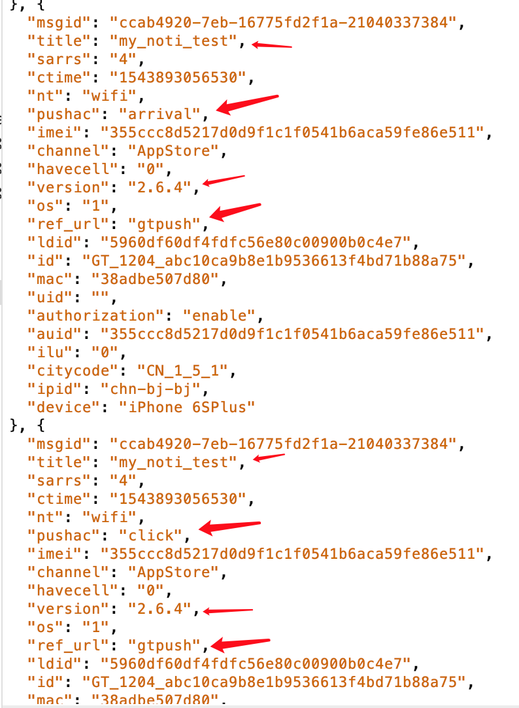

### 个推拓展SDK接入
#### 目标：精确上报统计
1. 增加启动应用通知授权上报。
2. 精确个推SDK统计通知消息抵达数。
3. 精确个推统计用户自定义回执(900010-曝光，900011-点击)
4. 精确应用客户端统计统计(曝光数，和点击数)

[客户端推送上报文档wiki](http://wiki.shandianshipin.cn:8090/pages/viewpage.action?pageId=12290046)

#### 个人四Debug包上报数据示例
1. 设备设置代理抓包链接Charles
2. 安装测试包，打开一次应用(会有通知注册机注册授权上报)

##### 1.上个推平台
1. 先不要激活客户端应用(应用杀死，或者退到后台)。
2. 选择dev4，
3. 选择iOS透传推送，填写测试推送消息，
4. 添加测试标签(限制推送目标设备)

##### 2.发送消息后查看本地
1. 发送消息后一会儿本地应当受到消息（可测试推送消息抵达曝光）。
2. 滑开通知栏点击推送（用于测试推送消息点击,如果直接点击应用打开则无点击上报）
3. 应用激活

##### 3.上报数据查看
> 此部分上报数据是本地统计的数据，可用于与GeTui那边进行对数验证。

1. 推送授权注册

2. 点击推送(点击通知栏推送消息):

3. 推送曝光(客户端通知栏暴露推送消息)：
> 如果不是通过点击通知幅打开启动应用，那么将不会有点击上报，只有曝光抵达上报。
 

